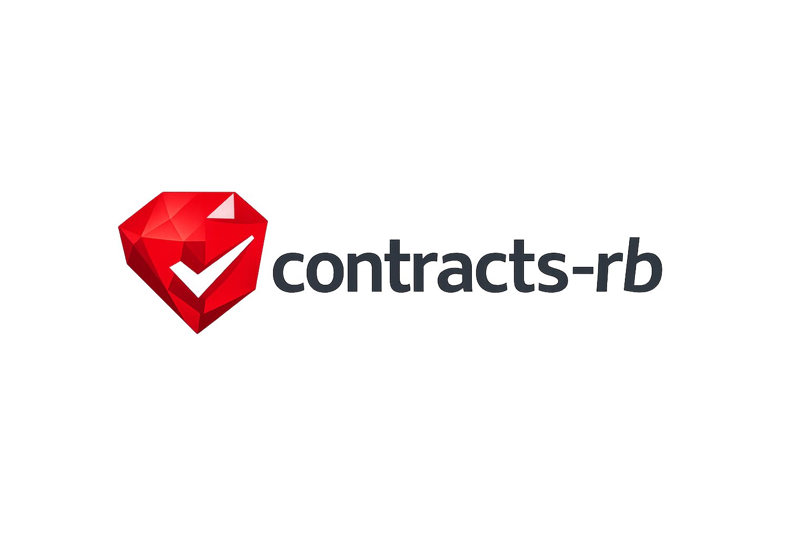

# contracts-rb



`contracts-rb` adds small, explicit behavioral contracts to Ruby without imposing a type system. It supports parameter and return constraints, preconditions, postconditions, object invariants, state snapshots, mutation policies, exception declarations, introspection, and a dependency-free CLI.

## Install

```ruby
gem "contracts-rb", "~> 0.1"
require "contracts"
```

## Five-minute example

```ruby
class Account
  include Contracts
  attr_reader :balance
  invariant("balance is non-negative") { balance >= 0 }

  contract :withdraw do
    params amount: Numeric
    requires("amount is positive") { |amount:| amount.positive? }
    requires("enough funds") { |amount:| amount <= balance }
    changes :balance
    returns Numeric
    ensures { |result, before:| balance == before.balance - result }
  end

  def initialize(balance:) = @balance = balance
  def withdraw(amount:) = (@balance -= amount)
end
```

Constraints include `Contracts.nilable`, `any`, `matching`, `range`, `one_of`, `array_of`, `hash_of`, `respond_to`, `duck_type`, `anything`, `nothing`, and `predicate`.

## Stateful contracts

Use `observe` to capture relevant receiver fields; `changes` permits a subset, `must_change` requires a transition, and `pure`/`changes_nothing` permits none. Snapshots are immutable (`before.balance`, `before[:balance]`, `before.metadata`) and `deep: true` protects nested arrays and hashes. Invariants run after initialization and around contracted methods by default. `Contracts.check_invariants!(object)` is available for explicit checks.

## Exceptions and inheritance

Declare exceptions with `raises PaymentError`; use `on_raise(PaymentError) { |error, before:| ... }` for rollback guarantees. Set `undeclared_exceptions` to `:warn` or `:violate` to enforce exception declarations. Inheritance mode defaults to `:merge`, applying parent parameter, precondition, postcondition, return, and observation rules to overriding child contracts. `:strict` rejects structural parameter constraint changes.

## Configuration and production use

```ruby
Contracts.configure do |config|
  config.enabled = true
  config.failure_mode = :log # :raise, :warn, :log, :collect
  config.sample_rate = 0.05
  config.undeclared_exceptions = :violate # :ignore, :warn, :violate
end
```

Errors avoid parameter values by default. Set `include_values_in_errors` only in trusted environments. Contracts complement tests and domain validation; use them for durable API promises and high-value invariants, not every local assertion.

## Tooling

`bundle exec contracts version`, `inspect`, `validate`, `doctor`, and `docs --format markdown|json --output PATH` are available. Load application code with `--require ./lib/my_app`.

`require "contracts/rspec"` provides basic RSpec matchers when RSpec is installed. `require "contracts/rails"` installs a lightweight optional Railtie.

## Compatibility

Ruby 3.1+. Rails is optional. The core is plain Ruby and has no runtime dependencies.

## Limitations

0.1.0 wraps declared instance methods directly; its explicit singleton API is experimental. Deep snapshots, static implication proofs for inheritance, and Rails instrumentation are intentionally deferred.

## Development

```sh
bundle install
bundle exec rake spec
gem build contracts-rb.gemspec
```

MIT licensed. See [CONTRIBUTING.md](CONTRIBUTING.md) and [SECURITY.md](SECURITY.md).

## Benchmark methodology

Run `bundle exec ruby benchmark/runtime_overhead.rb` on the deployment Ruby and hardware. Compare the included uncontracted and parameter/return-contracted methods; do not extrapolate those measurements to contracts that capture state or execute expensive predicates.
